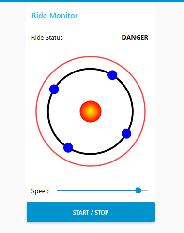
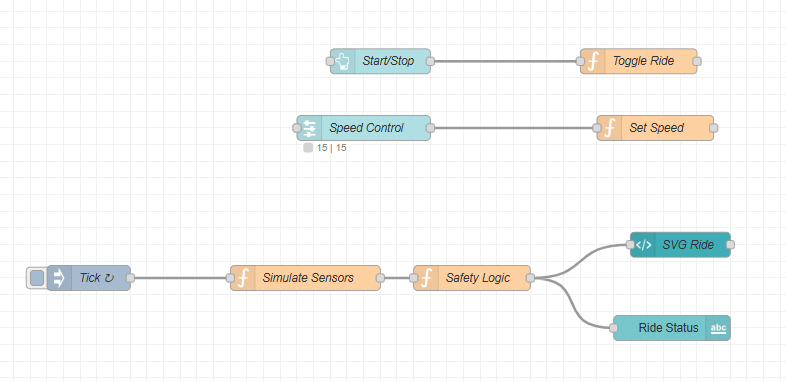
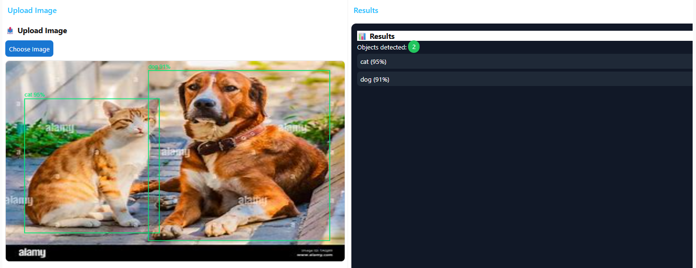
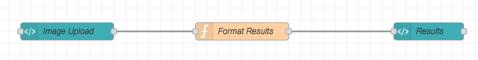
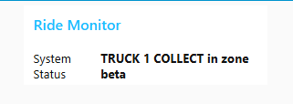
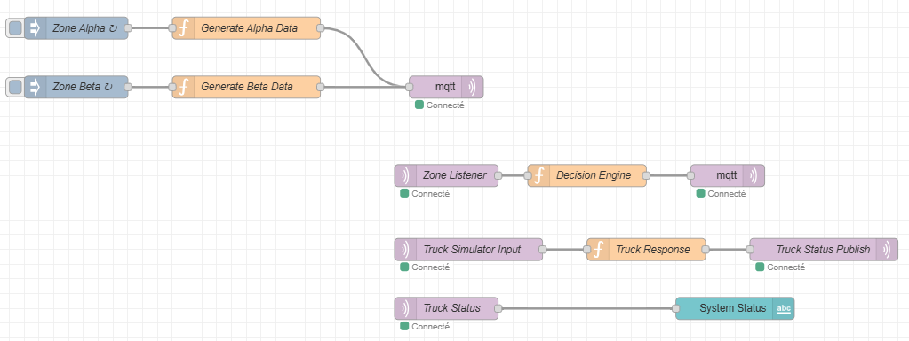

# 🛠️ IoT Node-RED Workshops

This repository provides a collection of practical IoT workshops, each implemented as a Node-RED project, demonstrating real-world techniques for interactive dashboards, machine learning integration, and distributed systems. The goal is to showcase how Node-RED can be used to simulate, visualize, control, and augment IoT scenarios using open source technologies.

- **What it demonstrates:**  
  - Real-time monitoring and visualization with dynamic SVG dashboards  
  - Integrated AI (object detection) directly in Node-RED flows  
  - Distributed event-driven architectures with MQTT  
  - Ready-to-import simulation flows for rapid experimentation

## Workshops Breakdown

### 🎡 SVG IoT Monitoring

**Description:**  
A simulated monitoring and control system for a park amusement ride using Node-RED Dashboard and dynamic SVG. Sensor data (e.g., temperature, speed, velocity, vibrations) are visualized in real time, and system states are clearly indicated.



**Features:**
- SVG-driven graphical interface
- Real-time display of multiple sensor values
- Visual indicators (e.g., colored dots representing seats)
- Ride controls: Start / Stop, dynamic speed adjustment
- "Risk status" indicator (safe/danger)

**How it Works:**
- **Node-RED Dashboard** hosts all UI: SVG template node renders live visuals of the ride and sensors.
- **Sensor simulation nodes** generate random/controlled data for temperature, speed, etc.
- **UI Controls:**  
  - A slider (`ui_slider`) allows speed control.
  - A button (`ui_button`) toggles the ride running state.
  - JavaScript function nodes (`Set Speed`, `Toggle Ride`) manage simulation logic and store values in Node-RED context.
- **Visual Updates:** UI elements like colored dots or SVG shapes change in response to flow/variables, reflecting real-time transitions and alerts.

**Technologies Used:**
- Node-RED Dashboard (UI nodes)
- SVG (via template nodes)
- JavaScript (for simulation logic)
- Node-RED context storage

<p align="center"></p>

**Possible Improvements:**
- Add historical data charts for trend analysis

---

### 🤖 Object Detection with TensorFlow.js

**Description:**  
A web-based object detection workflow using Node-RED and TensorFlow.js. Users upload images, which are processed for real-time object recognition.

<p align="center"></p>

**Features:**
- Image upload form in the Node-RED Dashboard
- Object detection via TensorFlow.js (COCO-SSD model)
- Bounding boxes drawn on detected objects
- Display of labels and confidence scores
- Results panel listing detected classes and their probabilities

**How it Works:**
- **UI:**  
  - "Upload Image" section (`ui_group`) for user image input
  - "Results" section displays detection output
- **Logic:**
  - Image node receives upload, triggers flow
  - JavaScript/Node.js nodes use TensorFlow.js module to process the image against COCO-SSD
  - Detected objects are output, with bounding boxes drawn on the image
  - Results are fed to a list in the dashboard for inspection

**Technologies Used:**
- Node-RED Dashboard (UI nodes)
- TensorFlow.js (Node version)
- COCO-SSD (pre-trained model)
- JavaScript (processing logic)

<p align="center"></p>

**Possible Improvements:**
- Allow webcam live-stream input

---

### 🛜 Distributed IoT System with MQTT

**Description:**  
A simulated distributed IoT system combining Node-RED and MQTT to represent interconnected zones and mobile entities (trucks).

<p align="center"></p>

**Features:**
- Emulates multiple zones (e.g., Zone Alpha, Zone Beta) and trucks
- Each zone publishes state information to MQTT topics (`zone/+/data`)
- Trucks subscribe to topics/events and act (e.g., "Truck 1 collects from Zone Beta")
- Zone/truck actions reflected in a real-time dashboard
- Tracks zone states, truck activities, and parameters like waste level

**How it Works:**
- **MQTT nodes**:  
  - `mqtt in` node listens to topics like `zone/+/data`
  - `mqtt out` nodes publish truck status updates (e.g., `truck/1/status`)
- **Function nodes** govern events (e.g., truck arrival/collection)
- **Dashboard UI**: show current truck status
- **Broker Setup:** Configured to `localhost`

**Technologies Used:**
- Node-RED
- MQTT (Mosquitto broker)
- Node-RED Dashboard
- JavaScript (simulation logic)

<p align="center"></p>

**Possible Improvements:**
- Add dynamic visualization of system topology

---

## How to Run

1. **Prerequisites**
   - Node.js (v18.16.1 or later)
   - Node-RED installed (`npm install -g node-red`)
   - Mosquitto broker (`sudo apt-get install mosquitto`)

2. **Clone the Repository**
   ```sh
   git clone https://github.com/Brahim-gz/iot-node-red-workshops.git
   cd iot-node-red-workshops
   ```

3. **Start Node-RED**
   ```sh
   node-red
   ```

4. **Import a Workshop Flow**
   - Open the Node-RED editor (at [http://localhost:1880](http://localhost:1880))
   - From the menu, select **Import**
   - Specify the path of the desired flow file:
     - `svg/flows.json`
     - `tensorflow/flows.json`
     - `mqtt/flows.json`
   - Deploy the flow

---

<p align="center"><strong>📡 A hands-on exploration of connected systems and IoT implementations 📡</strong></p>